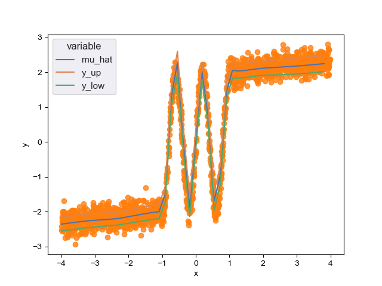

# Active learning for regression

_Uncertainty sampling for regression with neural networks._

A traditional NN will (implicitly) estimate the mean of the underlying function

$$
\hat y_i = \mu(x_i)
$$

However, the relationship between $x$ and $y$ is rarely fully deterministic. Rather, the value of $y_i$ is a random variable that depends on $x_i$ via the mean $\mu$ and other parameters $\lambda_1, \dots, \lambda_K$

$$
Y_i \sim D(\mu(x_i), \lambda_1(x_i), \dots \lambda_K(x_i))
$$

Here, I assume that the underlying distribution is a Gaussian, and I estimate its parameters $\mu$ and $\sigma$

$$
Y_i \sim \mathcal N (\mu(x_i), \sigma(x_i))
$$

In this way, the _uncertainty_ of $Y$ can be quantified given $x$. This allows for uncertainty sampling.

Once a model is fitted with some data $x_1, \dots, x_N$, the next points to be labelled are selected by estimating $\sigma(x_i)$ for unlabeled data $x_{N+1}, \dots x_{N+M}$. K data points in $x_{N+1}, \dots x_{N+M}$ with the highest estimated uncertainty are selected, they are annotated, and the model is refitted with a combination of the old and the new datasets. This is iteratively repeated until the desired accuracy is reached.
